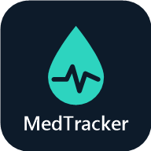

<h1 align="center">MedTracker</h1>

A personal medication and fasting sugar tracker that reads and writes a private Google Sheet. One HTML file, no framework, no build step, installable as a phone app.

---

## What it does

- **Summary at a glance:** latest fasting sugar, its 7-day and 30-day averages, the current Ozempic dose with the next planned one, and the latest HbA1c.
- **Daily medication:** which of the daily medicines were taken, as a grid for the current month. Earlier months are tucked into a collapsible group per year, like the sheet's own row groups.
- **Fasting sugar chart:** 1M / 3M / YTD / MAX ranges, with the normal fasting range shaded and a tooltip on every reading.
- **Ozempic dose chart:** the weekly dose as steps over time, with planned doses drawn dashed.
- **Lab results:** each test compared with the baseline, showing the change.
- **Add entry:** a small form for the day's checkboxes, dose and reading. It updates that day's row in the sheet if there is one, otherwise it adds a row in the right place.
- **Two-way sync:** the Google Sheet is the only store. Edits made in the sheet appear in the app on its next refresh, and edits made in the app appear in the sheet straight away.

## How it works

- Plain HTML, CSS and JavaScript in a single `index.html`, with [D3.js](https://d3js.org/) for charts and [PapaParse](https://www.papaparse.com/) for CSV.
- **Sign in with Google** (Google Identity Services). Only one Google account is allowed.
- Sheet data goes through a small private proxy, which calls the Google Sheets API and re-checks the sign-in on every request. The sheet itself is never published to the web.
- A web app manifest and a minimal service worker make it installable ("Add to Home screen").
- Hosted on GitHub Pages.

## Privacy

This is a single-user app for the owner's own data. There are no analytics, no trackers and no third parties; data only moves between the browser, the owner's private proxy and Google Sheets. See the [privacy policy](https://mneyshtadt-stack.github.io/MedTracker/privacy.html).

This code is shared for reference only. Signing in is limited to the owner's account, so the live app won't open for anyone else.
